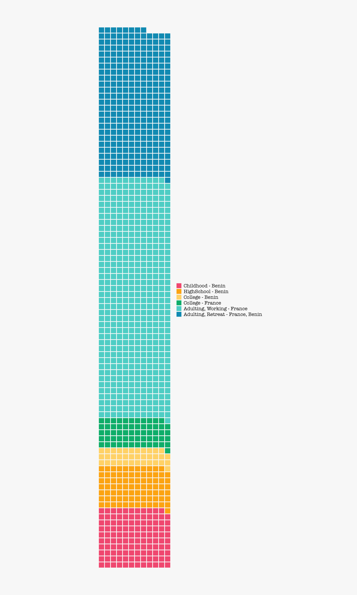

```{r setup, include=FALSE}
library(tidyverse)
library(lubridate)
library(waffle)
library(ragg)
knitr::opts_chunk$set(echo = T, warning = F, message = F)
```

All those graphics are built using R 4.0.4 [@R-base].
Sometimes all the information ist not in the body ^[Because it is in the footer].
When you do that you'll add footnote ^[By adding footnote syntax].

```{r data_creation}
life_data <- tibble(
  months = factor(rep(month.abb, 90), levels = month.abb)
) %>% 
  slice(5:n()) %>% 
  mutate(
    age = rep(0:100, each = 12, length.out = n())
  ) %>% 
  rowid_to_column("row_id")
life_data
```

<aside> 
this comment is on the side.
</aside>

```{r factoring_era}
life_data <- life_data %>% 
  mutate(era = fct_inorder(
    case_when(
      row_id < 12*10 ~ "Childhood - Benin",
      row_id < 12*17 ~ "HighSchool - Benin",
      row_id < 12*20 ~ "College - Benin",
      row_id < 12*25 ~ "College - France",
      row_id < 12*65 ~ "Adulting, Working - France",
      TRUE  ~ "Adulting, Retreat - France, Benin"
              )
  ))

life_data
```


```{r waffle_chart, results='hide'}
life_months <- life_data %>% 
  count(era) %>% 
  ggplot(aes(fill = era, values = n)) + 
    geom_waffle(color = "#F7F7F7", n_rows = 12, size = 1, flip = TRUE) +
     scale_fill_manual(name = "", values = c("#EF476F","#FCA311","#FFD166","#0EAD69","#4ECDC4","#118AB2")) + 
   coord_equal() + 
  theme_void(base_family ="Lato Medium") +
    theme(legend.text = element_text(family = "American Type Writer", size = 15),
        plot.background = element_rect(fill = "#F7F7F7", color = "#F7F7F7"))

```
```{r saving, include=FALSE}
ggsave("life_in_months.png", device = agg_png(),  width = 15, height = 25, dpi = 300)
```

```{r figure, echo=FALSE}

```

## Acknowledgments {.appendix}
You can recognize people and institutions in acknowledgments.

